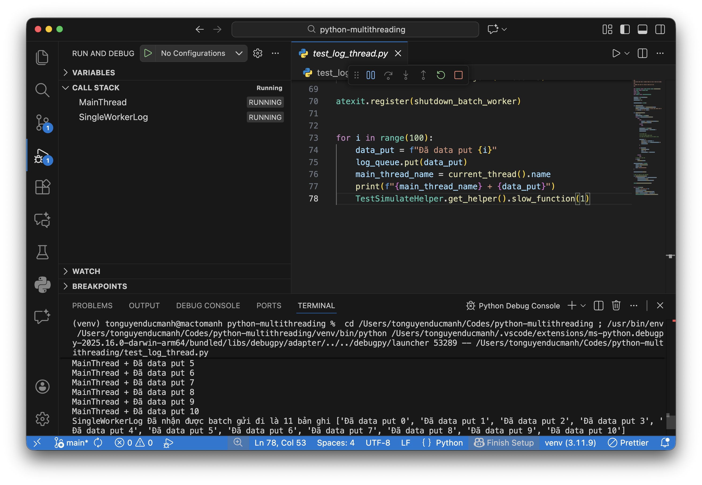
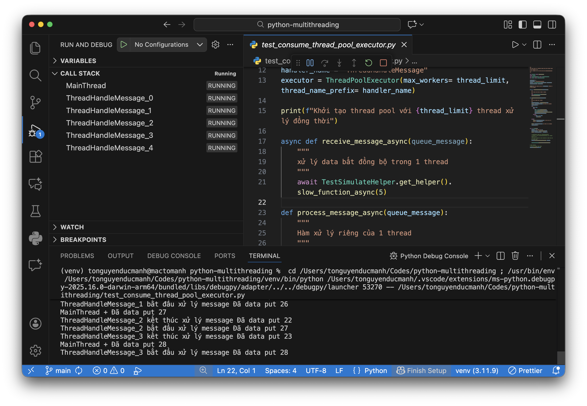

# Project test việc xử lý đa luồng trong python

tạo env

```
python3 -m venv venv
```

kích hoạt env

mac

```
source venv/bin/activate
```

window

```
venv\Scripts\activate.bat
```

## Test 1 thread get log



## Test multiple thread consume message


